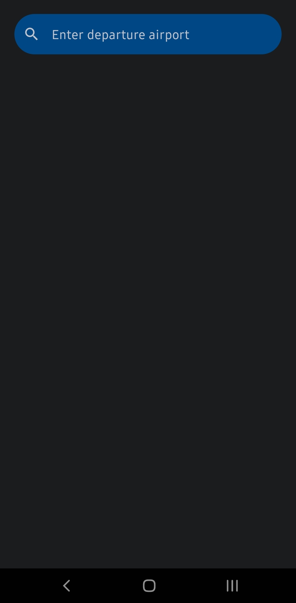
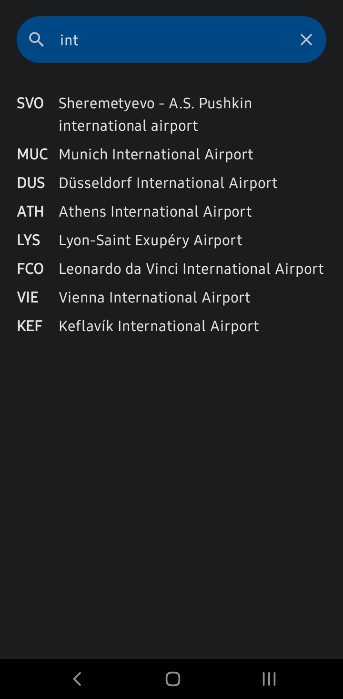
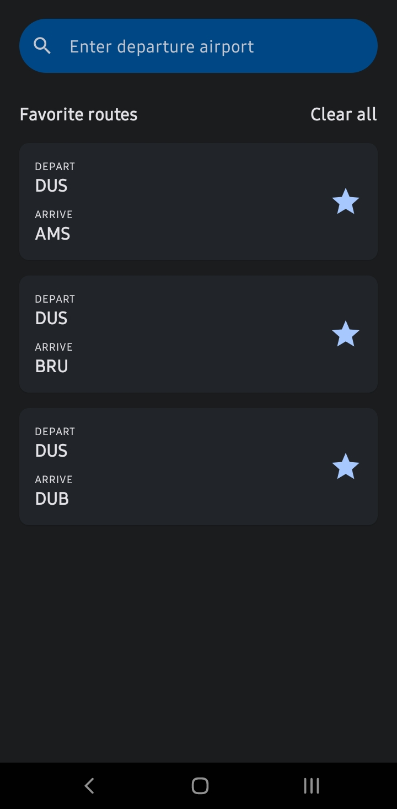

# FlightSearch
FlightSearch is an easy-to-use application that grants users access to flight information. This app enables users to find suitable flight options by inputting their preferences, offering them flight recommendations sourced from a database. Users can delve deeper into their choices by exploring available flights when selecting a specific airport. Moreover, FlightSearch ensures the security of user-selected flights, storing them for effortless retrieval.

## Features
- **Explore Available Flights** - Upon selecting a specific airport, you can easily access a list of available flights.
- **Secure Storage** - Store your favorite flights securely in the database for future reference and retrieval.

## Data Storage
FlightSearch utilizes two key data storage mechanisms to ensure a smooth user experience:

- **Room Database** - I used Room, an Android architecture component, to efficiently manage the storage of flight information. This database is the backbone of the app, facilitating the retrieval and storage of flight data.

- **DataStore** - I implemented DataStore to handle local storage, providing a reliable solution for saving and retrieving user preferences, including their input in the search bar.

## Syncing Saved and Deleted Items
One of the main challenges in developing FlightSearch was ensuring the synchronization of saved and deleted items across the app. I tackled this challenge by implementing robust functions in the ViewModel, allowing for a seamless experience when managing selected flights.

## Preview

    &nbsp;&nbsp;
    &nbsp;&nbsp;
    &nbsp;&nbsp;
    

